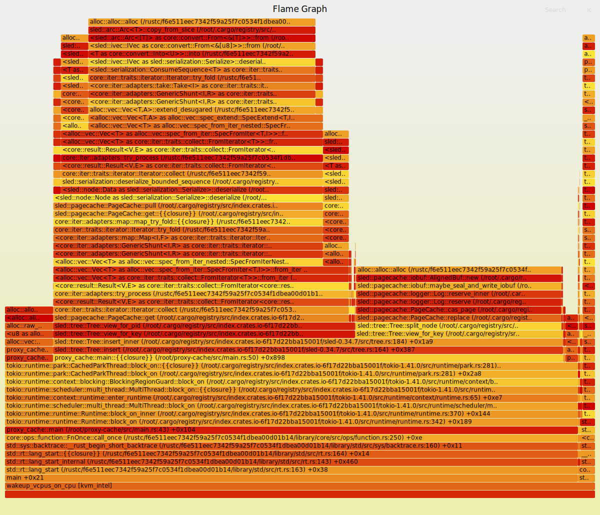

# rust-memleak


## Prerequisites

1. stable rust toolchains: `rustup toolchain install stable`
1. nightly rust toolchains: `rustup toolchain install nightly --component rust-src`
1. (if cross-compiling) rustup target: `rustup target add ${ARCH}-unknown-linux-musl`
1. (if cross-compiling) LLVM: (e.g.) `brew install llvm` (on macOS)
1. (if cross-compiling) C toolchain: (e.g.) [`brew install filosottile/musl-cross/musl-cross`](https://github.com/FiloSottile/homebrew-musl-cross) (on macOS)
1. bpf-linker: `cargo install bpf-linker` (`--no-default-features` on macOS)


## Build

```shell
$ AYA_BUILD_EBPF=true cargo build --release
```

or

```shell
$ make
```


## Cross-compiling on macOS

Cross compilation should work on both Intel and Apple Silicon Macs.

```shell
AYA_BUILD_EBPF=true CC=${ARCH}-linux-musl-gcc cargo build --package rust-memleak --release \
  --target=${ARCH}-unknown-linux-musl \
  --config=target.${ARCH}-unknown-linux-musl.linker=\"${ARCH}-linux-musl-gcc\"
```
The cross-compiled program `target/${ARCH}-unknown-linux-musl/release/rust-memleak` can be
copied to a Linux server or VM and run there.


## Notice

The target Rust application needs to enable stack frame compilation:

```
$ RUSTFLAGS="-C force-frame-pointers=yes" cargo build
```


## Usage

```shell
Usage: rust-memleak [OPTIONS] --pid <PID>

Options:
  -p, --pid <PID>            pid of the process
  -b, --bin <BIN>            binary path [optional]
  -i, --interval <INTERVAL>  interval in seconds [default: 10]
  -o, --output <OUTPUT>      output file [default: /tmp/memleak.out]
  -v, --verbose              verbose mode
  -h, --help                 Print help
```


### Example:

```shell
# ./target/debug/rust-memleak --pid 20088
```

Generating flame graphs:

```shell
# ./FlameGraph/flamegraph.pl /tmp/memleak.out > /tmp/1.svg
```

Flame graph:




## Reference

[https://github.com/rust-lang/rust/blob/master/library/alloc/src/alloc.rs#L16-L38](https://github.com/rust-lang/rust/blob/master/library/alloc/src/alloc.rs#L16-L38)

[https://github.com/iovisor/bcc/blob/master/libbpf-tools/memleak.bpf.c](https://github.com/iovisor/bcc/blob/master/libbpf-tools/memleak.bpf.c)

[https://github.com/brendangregg/FlameGraph](https://github.com/brendangregg/FlameGraph)

